# Tournament Bracket Manager

A modern, interactive tournament bracket manager built with Python and Pygame, featuring a sleek 2026-inspired UI with glassmorphism effects and a comprehensive user tour system.


## Features

### 🏆 Tournament Management
- **Multi-Tournament System** - Create and manage multiple tournaments
- **Editable Details** - Click to edit tournament name, location, date, and time
- **Dynamic Brackets** - Automatically generates single-elimination brackets
- **Smart Bye Assignment** - Handles non-power-of-2 player counts
- **Auto-Save** - All changes automatically persist to disk

### 👥 Player Management
- **Easy Add/Remove** - Simple interface for managing participants
- **Dynamic Scaling** - UI adapts to 2-64+ players
- **Visual Feedback** - Color-coded status indicators

### 🎮 Interactive Brackets
- **Click-to-Select** - Click matches to select, click players to declare winners
- **Visual Winners** - Green checkmarks indicate victors
- **Auto-Advancement** - Winners automatically progress through rounds
- **Final Results** - Champion highlighted in gold

### 🎨 Modern 2026 UI Design
- **Glassmorphism Effects** - Semi-transparent cards with subtle shadows
- **Smooth Animations** - Micro-interactions and hover states
- **Responsive Layout** - Dynamic font and element scaling
- **High Contrast** - Accessible color palette
- **Touch-Friendly** - Larger hit targets and spacing

### 📚 Interactive Tour System
- **13-Step Guided Tour** - Learn all features interactively
- **Pulsing Highlights** - Animated borders guide attention
- **Auto-Navigation** - Tour switches tabs automatically
- **Skip Anytime** - Press ESC or click Skip Tour

### ✅ Comprehensive Testing
- **38 Automated Tests** - 100% pass rate
- **Full Coverage** - All features verified
- **CI/CD Ready** - Headless mode for automation

## Screenshots

### 1. Tournament List - Multi-Tournament Management
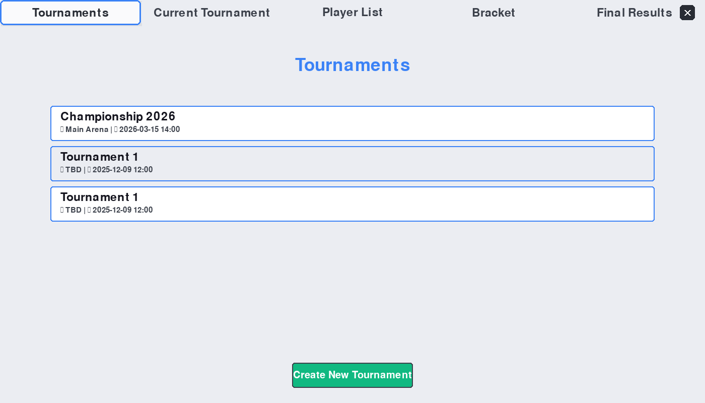
*Create and manage multiple tournaments with full metadata tracking*

### 2. Tournament Details - Editable Fields
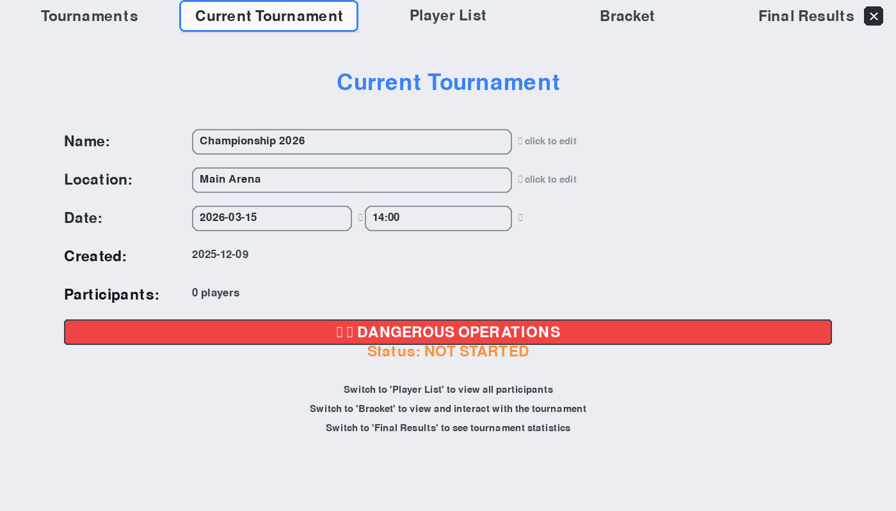
*Click any field to edit tournament name, location, date, and time with visual indicators*

### 3. Player Management
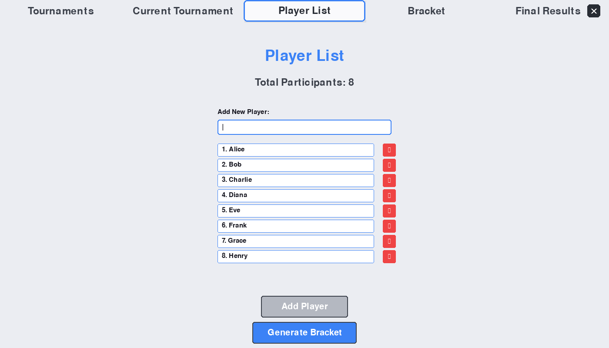
*Add and remove players with a clean, intuitive interface*

### 4. Dynamic Bracket Generation
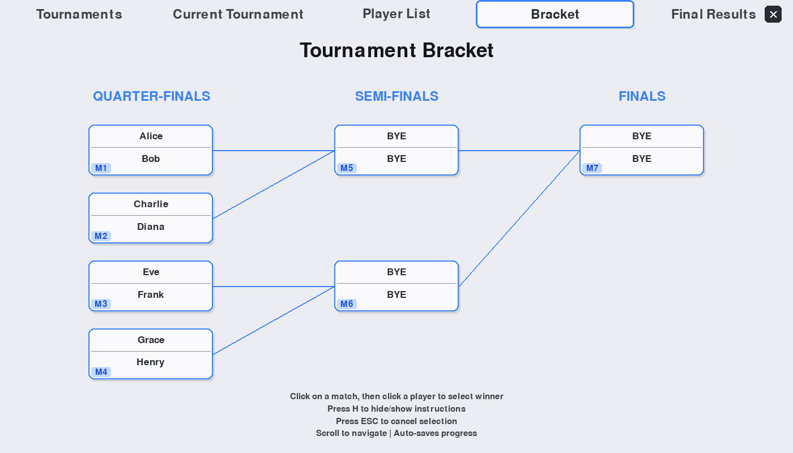
*Automatically generated single-elimination brackets with smart bye assignment*

### 5. Interactive Match Selection
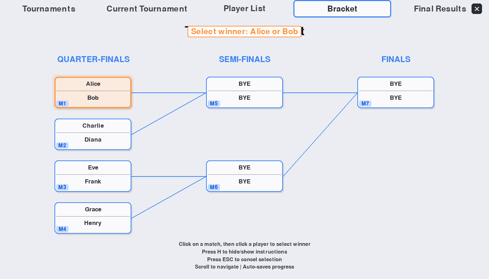
*Click matches to select, highlighted with blue glow for clear feedback*

### 6. Winner Declaration
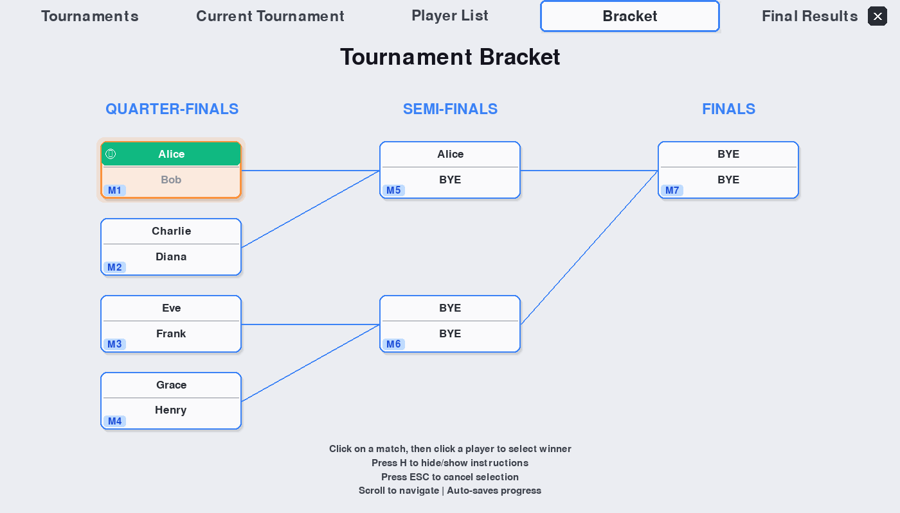
*Click player names to declare winners - green checkmarks indicate victors*

### 7. Tournament in Progress
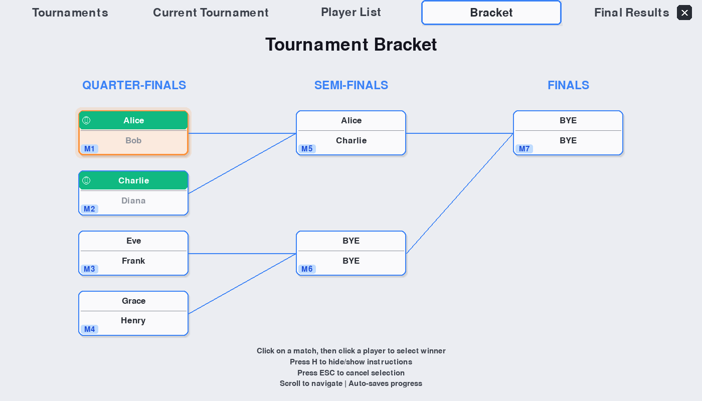
*Winners automatically advance through rounds with visual tracking*

### 8. Final Results
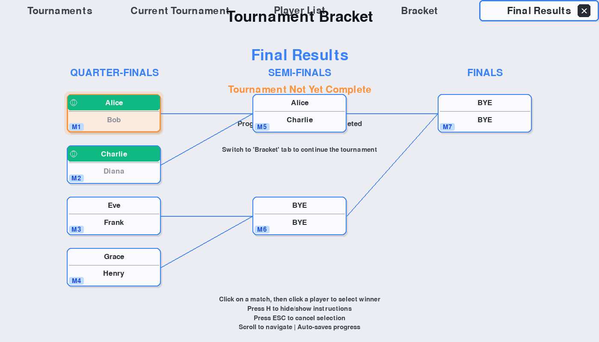
*Champion highlighted in gold with complete tournament standings*

### 9. Interactive Tour Mode
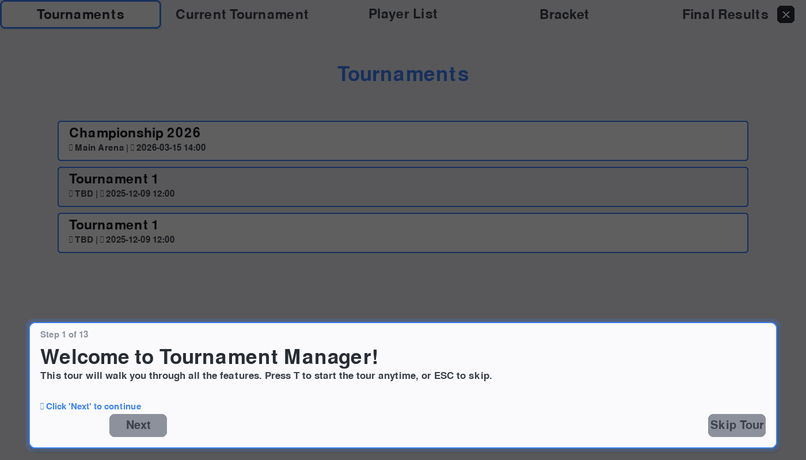
*Press T to start the interactive 13-step guided tour*

### 10. Tour Highlights
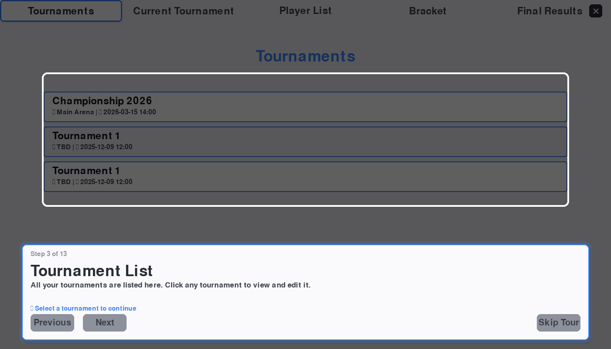
*Pulsing animated borders guide users through each feature*

### 11. Editable Field Interaction
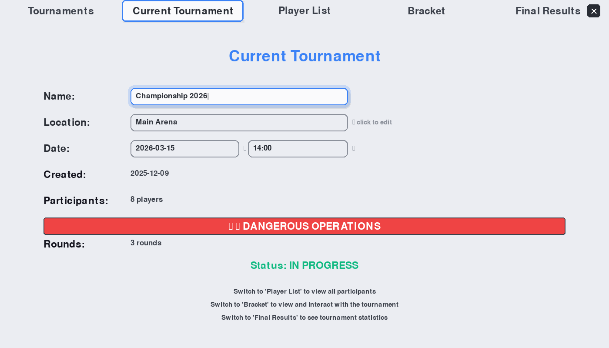
*Active editing mode with blinking cursor and modern input styling*

### 12. Dangerous Operations Panel
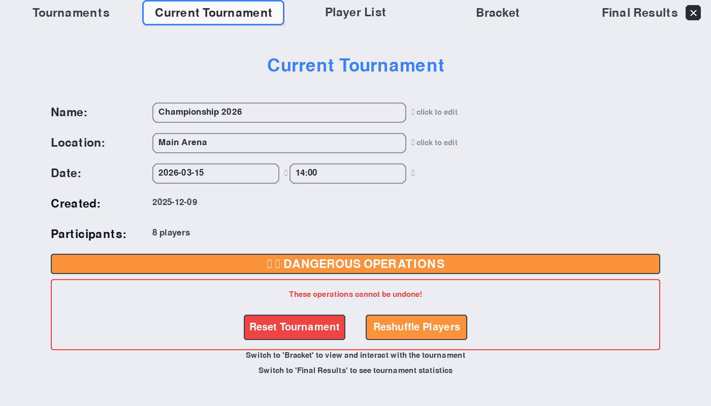
*Reset and reshuffle options clearly separated with warning styling*

### 13. Modern Glassmorphism UI
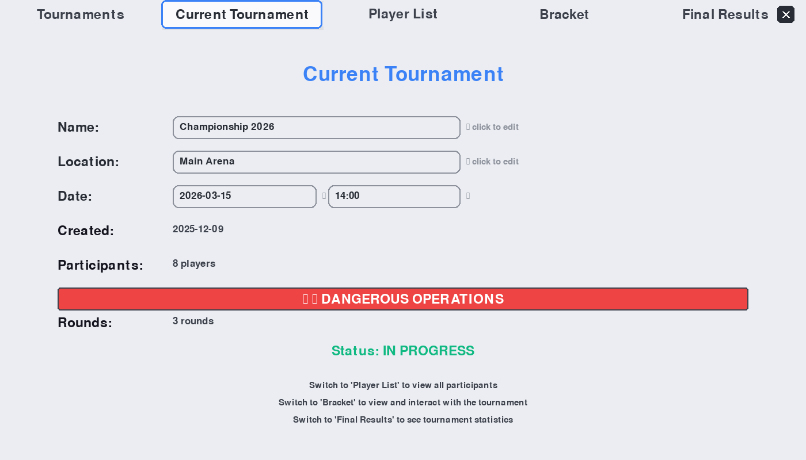
*2026 design trends with semi-transparent cards, shadows, and smooth gradients*

> **Note:** To capture these screenshots yourself, run:
> ```bash
> python capture_screenshots.py
> ```
> Then press SPACE at each mode to save screenshots. Navigate through all tabs and features.

## Installation

### Prerequisites
- Python 3.12 or higher
- pip (Python package installer)

### Setup

1. **Clone the repository**
```bash
git clone https://github.com/yourusername/tournament-bracket-manager.git
cd tournament-bracket-manager
```

2. **Create virtual environment**
```bash
python -m venv .venv
```

3. **Activate virtual environment**

Windows (PowerShell):
```powershell
.\.venv\Scripts\Activate.ps1
```

macOS/Linux:
```bash
source .venv/bin/activate
```

4. **Install dependencies**
```bash
pip install pygame
```

## Usage

### Running the Application

```bash
python tournament.py
```

Or use the demo file:
```bash
python demo.py
```

### Keyboard Shortcuts

| Key | Action |
|-----|--------|
| `T` | Start/restart interactive tour |
| `H` | Toggle help instructions (Bracket tab) |
| `ESC` | Cancel editing / Close dialogs / Exit tour |
| `Enter` | Save text input / Add player |
| `Backspace` | Delete character in text input |

### Quick Start Guide

1. **Launch the app** - Run `python tournament.py`
2. **Press `T`** - Start the interactive tour
3. **Follow the tour** - Learn all features step-by-step
4. **Create a tournament** - Click "Create New Tournament"
5. **Add players** - Switch to "Player List" tab and add participants
6. **Generate bracket** - Click "Generate Bracket"
7. **Run tournament** - Click matches to select, click players to declare winners
8. **View results** - Check "Final Results" tab for standings

## Testing

Run the comprehensive test suite:

```bash
python test_tournament.py
```

Expected output:
```
Ran 38 tests in ~6 seconds

OK
Success rate: 100.0%
```

### Test Coverage
- ✅ Match logic and winner selection
- ✅ Tournament metadata and serialization
- ✅ Bracket generation with byes
- ✅ Tour system navigation
- ✅ GUI interactions
- ✅ Auto-save functionality
- ✅ Edge cases (1-64 players)

See [TOUR_AND_TESTS.md](TOUR_AND_TESTS.md) for detailed test documentation.

## Project Structure

```
tournament-bracket-manager/
├── tournament.py          # Main application (1970+ lines)
├── demo.py               # Synced copy for running
├── test_tournament.py    # Comprehensive test suite (38 tests)
├── TOUR_AND_TESTS.md     # Tour and testing documentation
├── README.md             # This file
├── .gitignore           # Git exclusions
├── tournaments/         # Saved tournament data (JSON)
└── .venv/              # Virtual environment (not committed)
```

## Architecture

### Core Classes

- **`TournamentBracket`** - Single-elimination bracket logic
- **`TournamentMetadata`** - Tournament metadata (name, location, dates)
- **`Match`** - Individual match representation
- **`TournamentBracketGUI`** - Pygame GUI with 5 tabs
- **`TourStep`** - Tour system step definition

### Data Persistence

Tournaments are saved as JSON files in the `tournaments/` directory:
- Each tournament gets a UUID-based filename
- Includes metadata, participants, and match results
- Auto-saved on every change

## Design Philosophy

### 2026 Design Trends
- **Glassmorphism** - Frosted glass effects with semi-transparency
- **Micro-interactions** - Subtle animations on hover and click
- **Bold Typography** - Larger, more readable fonts
- **Generous Spacing** - Touch-friendly 40-50px hit targets
- **Status Indicators** - Visual checkmarks and color coding

### Color Palette
- **Primary Blue**: `#3B82F6` - Main interactive elements
- **Accent Green**: `#10B981` - Success states, winners
- **Accent Orange**: `#FB923C` - Warnings
- **Accent Red**: `#EF4444` - Dangerous operations
- **Grays**: High-contrast accessible grays

## Contributing

Contributions are welcome! Please follow these guidelines:

1. **Fork the repository**
2. **Create a feature branch** (`git checkout -b feature/amazing-feature`)
3. **Write tests** for new features
4. **Ensure all tests pass** (`python test_tournament.py`)
5. **Commit your changes** (`git commit -m 'Add amazing feature'`)
6. **Push to the branch** (`git push origin feature/amazing-feature`)
7. **Open a Pull Request**

### Development Guidelines

- Maintain 100% test pass rate
- Add tour steps for new features
- Follow existing code style
- Update documentation

## Roadmap

### Planned Features
- [ ] Double elimination brackets
- [ ] Swiss system tournaments
- [ ] Seeding and ranking
- [ ] Match scheduling
- [ ] Print-friendly bracket export
- [ ] Import from CSV/Excel
- [ ] Tournament statistics and analytics
- [ ] Multi-language support
- [ ] Cloud sync option
- [ ] Mobile companion app

## Capturing Screenshots

To capture screenshots for documentation:

### Using the Screenshot Tool

1. **Run the screenshot utility**:
```bash
python capture_screenshots.py
```

2. **Navigate through the app** and capture each mode:
   - Press **SPACE** to capture current screen
   - Press **T** to activate tour mode
   - Press **Q** to quit and save all screenshots

3. **Suggested screenshots** to capture:
   - Tournaments list tab
   - Current tournament with editable fields  
   - Player list with several players
   - Empty bracket after generation
   - Bracket with selected match
   - Bracket with winners declared
   - Final results tab
   - Tour mode welcome screen
   - Tour mode with highlighted element
   - Dangerous operations panel

4. Screenshots are saved to `./screenshots/` directory

### Manual Screenshots

You can also use standard screenshot tools:
- **Windows**: `Win + Shift + S` (Snipping Tool)
- **macOS**: `Cmd + Shift + 4`
- **Linux**: `gnome-screenshot` or similar

Recommended size: 1400x800 (app window size)

## License

This project is licensed under the MIT License - see below for details.

```
MIT License

Copyright (c) 2025

Permission is hereby granted, free of charge, to any person obtaining a copy
of this software and associated documentation files (the "Software"), to deal
in the Software without restriction, including without limitation the rights
to use, copy, modify, merge, publish, distribute, sublicense, and/or sell
copies of the Software, and to permit persons to whom the Software is
furnished to do so, subject to the following conditions:

The above copyright notice and this permission notice shall be included in all
copies or substantial portions of the Software.

THE SOFTWARE IS PROVIDED "AS IS", WITHOUT WARRANTY OF ANY KIND, EXPRESS OR
IMPLIED, INCLUDING BUT NOT LIMITED TO THE WARRANTIES OF MERCHANTABILITY,
FITNESS FOR A PARTICULAR PURPOSE AND NONINFRINGEMENT. IN NO EVENT SHALL THE
AUTHORS OR COPYRIGHT HOLDERS BE LIABLE FOR ANY CLAIM, DAMAGES OR OTHER
LIABILITY, WHETHER IN AN ACTION OF CONTRACT, TORT OR OTHERWISE, ARISING FROM,
OUT OF OR IN CONNECTION WITH THE SOFTWARE OR THE USE OR OTHER DEALINGS IN THE
SOFTWARE.
```

## Acknowledgments

- Built with [Pygame](https://www.pygame.org/)
- Inspired by modern design trends and tournament management needs
- Community feedback and contributions welcome

## Support

For issues, questions, or suggestions:
- 🐛 [Open an issue](https://github.com/yourusername/tournament-bracket-manager/issues)
- 💡 [Start a discussion](https://github.com/yourusername/tournament-bracket-manager/discussions)

## Author

Created with ❤️ by [Your Name]

---

**⭐ Star this repo if you find it useful!**
